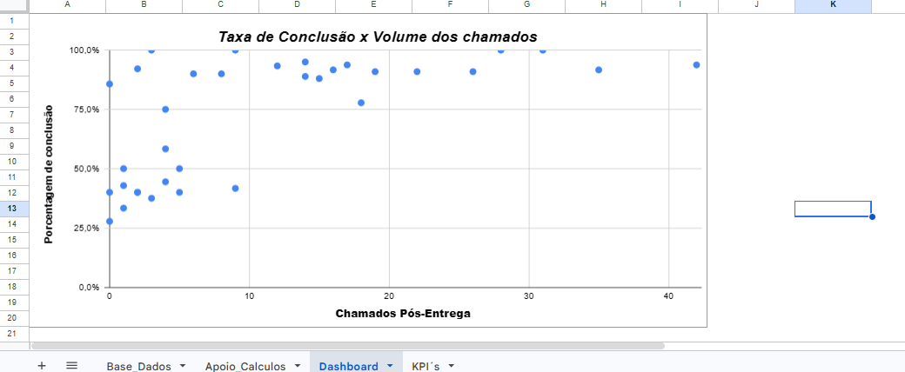

# 📊 Tracker Onboarding & Sustentação B2B

Dashboard analítico desenvolvido no Google Sheets para monitorar o ciclo de vida de implantações de software e reduzir o volume de chamados no suporte pós-entrega através da análise de engajamento dos usuários.

## 🚩 O Problema

Em empresas de software B2B, existe um padrão silencioso que custa caro para a operação: o cliente assina o contrato, passa pela implantação e, logo nas primeiras semanas, o time de suporte começa a receber um volume altíssimo de chamados básicos. 

Os principais sintomas operacionais observados incluem:
* Prazos de implantação estourando frequentemente.
* Alto índice de chamados na Sustentação (N1/N2) nos primeiros 60 dias de uso.
* Falta de visibilidade sobre a adesão real do cliente ao produto.

## 💡 A Solução e Arquitetura do Projeto

Desenvolvimento de uma solução de monitoramento focada em cruzar dados de implantação com o comportamento pós-entrega. O projeto foi estruturado utilizando boas práticas de modelagem de dados, dividindo a lógica em camadas:

1. **Cálculo Individual (Granular):** Base detalhada por ID de Cliente para acompanhamento de desvios de prazo e geração de alertas automáticos para clientes em Risco Alto.
2. **Cálculo de Grupos (Agregado):** Isolamento das métricas globais de performance para alimentar o painel gerencial.

## 📈 Principais Insights e Resultados (Data Storytelling)

A partir dos dados analisados, foi possível estabelecer as seguintes métricas globais da operação:
* **Prazo Médio de Implantação:** 49 dias.
* **Taxa Média de Conclusão de Treinamento:** 71,3%.
* **Volume Médio de Chamados (60 dias):** 11 chamados por cliente.

### A Correlação Crítica (Análise Visual)
A análise visual através do gráfico de dispersão confirmou a hipótese central do negócio: **existe uma forte correlação negativa entre a taxa de treinamento e o volume de suporte**. 

Foi constatado que clientes com uma **maior taxa de conclusão de treinamento** apresentam uma queda drástica no volume de chamados pós-entrega. Em contrapartida, clientes cujo treinamento teve baixa adesão são os maiores ofensores da fila de sustentação.

## 🛠️ Ferramentas e Técnicas Utilizadas

* **Google Sheets:** Estruturação de dados e criação das lógicas de negócio.
* **Arquitetura de Dados:** Separação clara entre tabelas de fatos (cálculos individuais) e agregações (médias de grupo).
* **Fórmulas Lógicas e Condicionais (SE, E, OU):** Para classificação automatizada do "Alerta de Risco" e regras de notificação.
* **Visualização de Dados (Gráfico de Dispersão):** Para comprovação estatística e visual da correlação entre o engajamento no treinamento e o impacto no suporte operacional.
